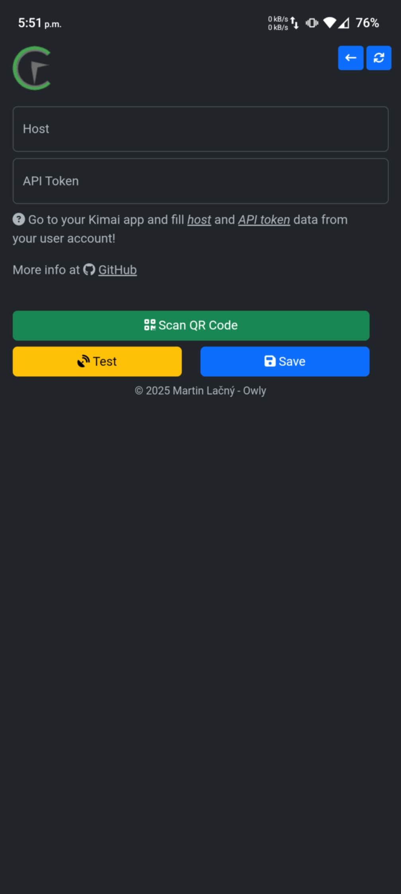

# CodeTimer-Mobile with QR Code Scanner

This is a fork of [CodeTimer-Mobile](https://github.com/owlysk/CodeTimer-Mobile) with added QR code scanning functionality for quick setup with the Kimai Mobile Setup plugin.

## New Features in This Fork

### QR Code Scanner for Quick Setup
- Scan QR codes from the Kimai Mobile Setup plugin
- Automatically configure server URL and API token
- No more manual typing of credentials
- One-click setup process

[Download the Latest APK](https://github.com/supg/CodeTimer-Mobile-QRScan/releases/latest)

## Prerequisites

### Kimai Mobile Setup Bundle Plugin Required

**IMPORTANT:** To use the QR code scanner feature, you must have the **Kimai Mobile Setup Bundle** plugin installed on your Kimai2 instance.

**Install the plugin:**
1. Follow the installation instructions at: [cloudrizon/kimai-mobile-setup-bundle](https://github.com/cloudrizon/kimai-mobile-setup-bundle)
2. Once installed, the plugin will add a "Mobile Setup" section to your Kimai user profile
3. This section allows you to generate QR codes containing your server URL and API token

**Without this plugin:**
- You can still use the app by manually entering your server URL and API token
- The QR code scanner button will work but you won't have QR codes to scan

## Installation

### Option 1: Download Pre-built APK (Recommended)
1. Go to [Releases](https://github.com/supg/CodeTimer-Mobile-QRScan/releases/latest)
2. Download the APK: `CodeTimer-Mobile-QRScan-v1.2.0.apk`
3. Enable "Install from Unknown Sources" on your Android device
4. Install the APK

### Option 2: Build from Source
```bash
git clone https://github.com/supg/CodeTimer-Mobile-QRScan.git
cd CodeTimer-Mobile-QRScan
npm install
cordova platform add android
cordova build android
```

## How to Use QR Code Scanner

1. Open the CodeTimer Mobile app
2. Go to **Settings** (gear icon)
3. Click **"Scan QR Code"** (green button)
4. Allow camera permissions when prompted
5. Scan the QR code from your Kimai Mobile Setup plugin
6. Click **"Save"** to complete setup

For detailed documentation, see [BARCODE_SETUP.md](BARCODE_SETUP.md)

## What is CodeTimer?
CodeTimer is simple small app to work with your Kimai software. You have to install Kimai app first to get CodeTimer working!

- More info about [Kimai](https://www.kimai.org/)
- [CodeTimer desktop](https://github.com/owlysk/CodeTimer)
- [Original CodeTimer-Mobile](https://github.com/owlysk/CodeTimer-Mobile)

You can try CodeTimer with Kimai [DEMO](https://www.kimai.org/en/demo.html):
- Host : `https://demo.kimai.org`
- API token :  `token_user`

## Credits & Acknowledgments

### Original Author
**CodeTimer-Mobile** by Martin Lačný - Owly
If you enjoy the original app, support the developer:

<a href="https://www.buymeacoffee.com/owlysk" target="_blank"></a>

### Acknowledgments

**[cloudrizon](https://github.com/cloudrizon)** - Creator of the [Kimai Mobile Setup Bundle](https://github.com/cloudrizon/kimai-mobile-setup-bundle) plugin, which generates the QR codes that this app's scanner feature integrates with. This mobile app fork builds upon their excellent work to provide seamless mobile setup.

**QR Code Scanner Integration** - This fork adds QR code scanning functionality specifically designed to work with cloudrizon's Kimai Mobile Setup Bundle plugin.

# Use HTTPS

If you use Kimai as self hosted, you have to configure SSL (HTTPS). __App work only with HTTPS__.

# Screenshots

 

*Left: Main time tracking screen | Right: Settings with new "Scan QR Code" button*


